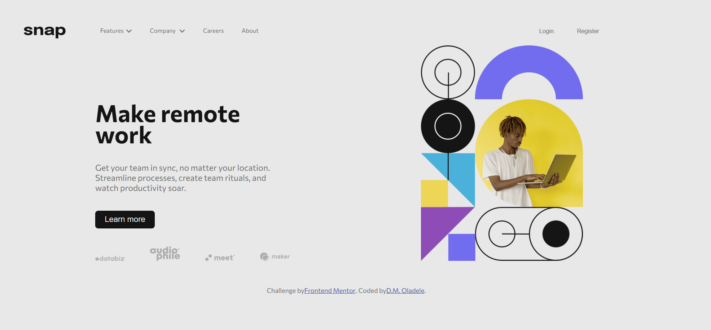

## Table of contents

- [Overview](#overview)
  - [The challenge](#the-challenge)
  - [Screenshot](#screenshot)
  - [Links](#links)
- [My process](#my-process)
  - [Built with](#built-with)
  - [What I learned](#what-i-learned)
  - [Continued development](#continued-development)
  - [Useful resources](#useful-resources)
- [Author](#author)

## Overview

### The challenge

Users should be able to:

- View the relevant dropdown menus on desktop and mobile when interacting with the navigation links
- View the optimal layout for the content depending on their device's screen size
- See hover states for all interactive elements on the page

### Screenshot

### Links

- Solution URL: [Add solution URL here](https://your-solution-url.com)
- Live Site URL: [Add live site URL here](https://your-live-site-url.com)

## My process

### Built with

- Semantic HTML5 markup
- CSS custom properties
- Flexbox
- CSS Grid
- Vanilla Javascript

### What I learned
I learned more about positioning and also the making of dropdown options using css and javaScript. I also learned how to switch from a top navigation in desktop view to side navigatiion in mobile view

### Continued development

I need to learn more of css animations

### Useful resources

- https://www.w3schools.com/howto/howto_js_responsive_navbar_dropdown.asp](https://www.w3schools.com/howto/howto_js_responsive_navbar_dropdown.asp) - This helped me create a side navigation bar.

## Author

- Blog - [@yD.M. Oladele](https://activuscode.hashnode.dev/)
- Twitter - [@activus_d](https://twitter.com/activus_d)
